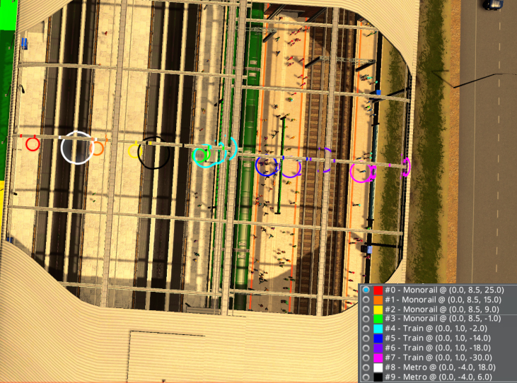
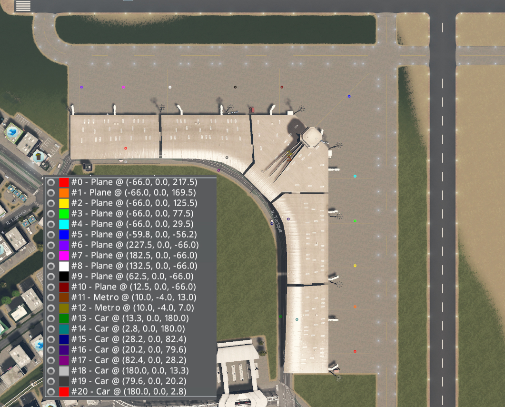

# Dynamic Text Props mod by Klyte45

This mod allows to create:

* Buildings layouts - Special props layouts based on building model - with or without text - inheriting the color from various different sources;
* Segments layouts - Customized props layouts for segments (any segment: road, train, electricty, etc);
* Street corner signs - Automatically place street corner signs, with information of the road name, current district, distance from zero marker, etc;
* Mileage marker signs - Automatically place mileage markers.

They'll be called as *types of layout* in this page.

## Mod integrations
### Addresses & Names Mod

All the configurations generated at the Addresses & Names mod that can be relevant for DTP are used, like the district color, 
zero marker and road name generation strategy.

## Mod Resources
### The basics
All assets can have a own config file, allowing it to be published at Steam Workshop. The file must be called `DefaultBuildingsConfig.xml`
and will be loaded on game load.

All local configurations files are stored at `<Cities Skylines AppData folder>/Klyte45Mods/DynamicTextProps/`.

In the root folder, are placed all **Libraries** that store defaults models that can be used to easily replicate a layout 
in various different configurations.

There's also a folder called `BuildingsDefaultPlacing` which were stored all the layouts for buildings that overrides
the default layouts stored in the assets' folder. The files must be named with the `xml` extension, but any name can be
used.

Every type of layout have a default font configuration to be used in the text items.

### Basic workflow

There's 3 configuration levels when creating layout:

* The text item, with the text configuration;
* The prop item, which contains a group of text items;
* The prop bunch, which contains a group of prop items and all their contents. (only for segment and buildings)

***WARNING***: Because of each type of layout have their own configuration, a text or prop item (or bunch) 
are not compatible with the other types of layoyts!

### Configuration Saving

Segments, mileage markers and street corners configurations are all saved inside the savegame. 

Buildings are saved in separate files, like was expained above in the basics topic. Only the default font configuration is saved in the savegame.

### Models library

There's 8 different libraries of layouts:

* `LibMileageMarkerProp.xml` - Lib with mileage marker props layouts;
* `LibMileageMarkerText.xml` - Lib with mileage marker text layouts;
* `LibCornerSignProp.xml` - Lib with street corner props layouts;
* `LibCornerSignText.xml` - Lib with street corner text layouts;
* `LibSegmentPropGroup.xml` - Lib with bunches of prop layouts to be used in segments;
* `LibSegmentProp.xml` - Lib with bunches of prop layouts to be used in segments;
* `LibSegmentText.xml` - Lib with bunches of prop layouts to be used in segments;
* `LibBuildingsPropGroup.xml` - Lib with bunches of prop layouts to be used in buildings;
* `LibBuildingsProp.xml` - Lib with prop layouts to be used in buildings;
* `LibBuildingsText.xml` - Lib with text layouts to be used inside props in buildings;

All them are created automatically via game UI, just by saving them on the library section of each part of the interface.

The fields of each `<item>` element in the Lib XML is the same of the listed below.

### Prop Groups XML layout 

#### Common

| **Field** | **Description** |
|:---------:|-----------------|
| saveName | The name used for display on lib dropdown   (Used only when contained in a lib)|

The child elements have are represented by the `<boardDescriptor>` element.

#### Buildings

The root node in building override and asset xml files is `<buildingConfig>`. The fields must be attributes in this tag.

| **Field** | **Description** |
|:---------:|-----------------|
| buildingName  | The full asset name which this layout will apply.   **WARNING**: The workshop id is always different of the local version name. |

#### Segments

There's no special fields for them.

### Prop layout XML layout

#### Common

| **Field**                               | **Description** |
|:---------------------------------------:|-----------------|
| saveName                                | The name used for display on lib dropdown if in a lib context, or the display name on tab at tabstrip|
| propName                                | The asset name of the prop to be used |
| positionX   positionY   positionZ | The coordinates relative to center of the reference   (Look the below topics to more information) |
| rotationX   rotationY   rotationZ | The rotation (degrees) of the prop in each axis - relative to own center |
| scaleX   scaleY   scaleZ          | The scale of the prop in each axis - relative to own center |

The child text elements are represented inside the `<textDescriptor>` element.

#### Buildings

The reference in this case is the **center of the building** - like in the asset editor.
<table>
    <thead>
        <tr>
            <th>Field</th>
            <th colspan="2">Values</th>
            <th>Description</th>
        </tr>
    </thead>
    <tbody>
        <tr>
            <td rowspan=4>coloringMode</td>
            <td><code>ByPlatform</code></td>
            <td>Gets from line in platform. See below about platforms.</td>
            <td rowspan=4>Configure the source of the prop paint color</td>
        </tr>
        <tr>
            <td><code>Fixed</code></td>
            <td>Gets from <code>fixedColor</code>.</td>
        </tr>
        <tr>
            <td><code>ByDistrict</code></td>
            <td>Gets  from district color (see note below).</td>
        </tr>
        <tr>
            <td><code>FromBuilding</code></td>
            <td>Get from building variation color</td>
        </tr>
        <tr>
            <td>showIfNoLine</td>
            <td colspan=2 align=center><code>true</code> or <code>false</code></td>
            <td >Tells if this prop (and its texts) will be shown even if there's no line assigned to target platform. See below about platforms.</td>
        </tr>
        <tr>
            <td>fixedColor</td>
            <td colspan=2 align=center><code>RRGGBB</code></td>
            <td>The fixed color to be used (only used if <code>coloringMode="Fixed"</code>).</td>
        </tr>
    </tbody>
</table>

Beside these attributes fields, there's a special element `<platformOrder>` that contains `
` children with the platform id in order. 
This element configuration is used to determine from which line the prop will get the configurations, specially for `showIfNoLine` and 
`coloringMode="ByPlatform"` values application. There's an image that shows how the platform layout id is generated:

The platform scan follow the order below: 

* Vehicle type, grouping by:
  * Airplanes
  * Helicopters
  * Ships
  * Ballons
  * Blimps
  * Ferries
  * Metro, Monorail and Train
  * Trams
  * Cars (buses)
* Y-axis (height). Higher platfomrs have lower ids;
* Z-axis (depth). Platforms nearest the building front have lower ids;
* X-axis (length). Platforms at left when looking the building from front have lower ids.

The most complex building in game (without mods) is the AD International Airport. Following the rules above, the layout is generated this way:

The part in the bottom of the image is the "front" of the building. So the stops numbering starts from bottom to top in this image angle. 
The platforms 6 - 10 are all in the same depth, so, they're numbered from left to right. Note the platform 5 is a little below of that stops depth.

After the aiplanes, in the priority order, the metro stops are mapped at platforms 11 and 12. Subbuildings are mapped along the main building.

The bus stops are mapped in same way the all rest were mapped, starting from bottom to top, from left to right. Due the curved road, theres a messed 
platform id distribution between the platforms 17 to 20: note the platform 20 is along with the platform 18 - the platform 19 is the outer stop relative
to the platform 17.

In this image example, I used the ***Touch This! Tool*** mod to change the road of the airport to a mixed tram/car road. Even making tram stops in the place
of the bus stops, the line will be selected at platform because the line type is not validated at play time, is only used to map the stops.

#### Segments

The reference in this case is the **position in the segment length**, which is defined in the field *segmentPosition*.

| **Field**                 |**Values**      | **Description** |
|:-------------------------:|:--------------:|-----------------|
| segmentPosition           |`0.0` to `1.0` | The position relative in the segment length|
| inverted                  |`true` or `false`| A convenient way to invert the side of the prop in the segment |
| color                     |`RRGGBB`       | The prop color |

#### Corner Signs

The reference in this case is the **middle point between the segments**.

| **Field**                 |**Values**      | **Description** |
|:-------------------------:|:--------------:|-----------------|
| fontName                  |string          | The font name to use in the texts |
| useDistrictColor          |`true` or `false`| Use the district color to paint the prop (See note below) |
| color                     |`RRGGBB`       | The prop color. Ignored if `useDistrictColor="true"` |

The district color is picked from Addresses & Names mod configuration. If this mod isn't available, a random color is given to the district.

#### Mileage Marker

The reference in this case is the **Center of the segment that the kilometer/mile is completed**

| **Field**                 |**Values**      | **Description** |
|:-------------------------:|:--------------:|-----------------|
| fontName                  |string          | The font name to use in the texts |
| useMiles                  |`true` or `false`| Count miles instead of kilometers to generate the markers |
| color                     |`RRGGBB`       | The prop color. Ignored if `useDistrictColor="true"` |

### Text layout XML descriptor
#### Common
| **Field**                                                       |  **Values**                       | **Description** |
|:---------------------------------------------------------------:|:---------------------------------:|-----------------|
| saveName                                                        |  string                           | The name used for display on lib dropdown if in a lib context, or the display name on tab at tabstrip|
| relativePositionX   relativePositionY   relativePositionZ |  float                            | The coordinates relative to center of the prop |
| relativeRotationX   relativeRotationY   relativeRotationZ |  float                            | The rotation (degrees) of the text in each axis - relative to own center with the prop transform |
| textScale														  |  float                            | The text scale. |
| maxWidth													      |  float                            | The max width of the text in meters. If exceeds, the text is resized horizontally. |
| applyOverflowResizingOnY										  |  `true` or `false`               | If `true`, applies the overflow scale redution also in the text height. |
| color															  |  `RRGGBB`                        | Text color. |
| useContrastColor												  |  `true` or `false`               | If `true`, use the contrast color (black or white) based on prop color. |
| textType                                                        | \<depends on type\>               | Indicate the source of the text. See below for each type |
| fixedText                                                       | string                            | The fixed text for use when `textType="Fixed"` | 
| nightEmissiveMultiplier                                         | float                             | The text emission at night, simulating light effect. Defaults 0. |
| dayEmissiveMultiplier                                           | float                             | The text emission at day, simulating light effect. Defaults 0. |
| textAlign                                                       | `Left` or `Center` or `Right`   | The text horizontal alignment |
| verticalAlign                                                   | `Top` or `Middle` or `Bottom`   | The text vertical alignment, based on generated mesh (no baseline) |
| shader                                                          | string                            | A replace shader to be used in this text. Any loaded shader is valid, but not all will work with texts |

#### Buildings

##### Text types

| `textType` value | Description |
|:-----------------:|--------------|
| OwnName | The name of the building|
| Fixed | A fixed text (set at `fixedText` field) |
| Custom1 | The next station name (empty if it's the final line station) **(*)**  |
| Custom2 | The previous station name **(*)** |
| Custom3 | The platform destination station name **(*)** |

**(*)** These configurations only works when prop is colorized by platform and the line vehicle type is Metro, Train or Monorail.

##### Extra fields

| **Field**     |  **Values**    | **Description** |
|:-------------:|:--------------:|-----------------|
|overrideFont   | string         | The font that will be used for rendering the text. Only works when `textType="OwnName"` or `textType="Fixed"`|

#### Segments

##### Text types

| `textType` value | Description |
|:-----------------:|--------------|
| OwnName | Uses the own content field. See below |

##### Extra fields

| **Field**     |  **Values**    | **Description** |
|:-------------:|:--------------:|-----------------|
|overrideFont   | string         | The font that will be used for rendering the text.|
|nameContent    | *see below*    | The `OwnName`configuration. Only used when `textType="OwnName"`|

##### `nameContent` values table

| `nameContent` value | Description |
|:-----------------:|--------------|
| None | Creates a test text. Useful to limit the width when creating signs inside the game |
| Custom | A fixed text (set at `fixedText` field) |

*Other contents will be added in the future*

#### Corner Signs

##### Text types

| `textType` value | Description |
|:-----------------:|--------------|
| OwnName | Creates a test text. Useful to limit the width when creating signs inside the game  |
| Fixed | A fixed text (set at `fixedText` field) |
| StreetPrefix | The street qualifier. Available if the street wasn't renamed manually. (Ex: Street, Avenue) |
| StreetSuffix | The street own name, without qualifier. Full street name if renamed manually.  |
| StreetNameComplete | The full street name, with qualifier |
| Custom1 | The district name  |
| Custom2 | The distance from the zero marker (in kilometers) |

##### Extra fields

There's no extra fields.

#### Mileage Marker

##### Text types

| `textType` value | Description |
|:-----------------:|--------------|
| OwnName | Creates a test text. Useful to limit the width when creating signs inside the game  |
| Fixed | A fixed text (set at `fixedText` field) |
| BuildingNumber | The value in kilometers or miles of the current mileage |
| Custom1 | The road cardinal direction (full length - 8 points - localized). Ex: East, Northwest, South...  |

##### Extra fields

There's no extra fields.